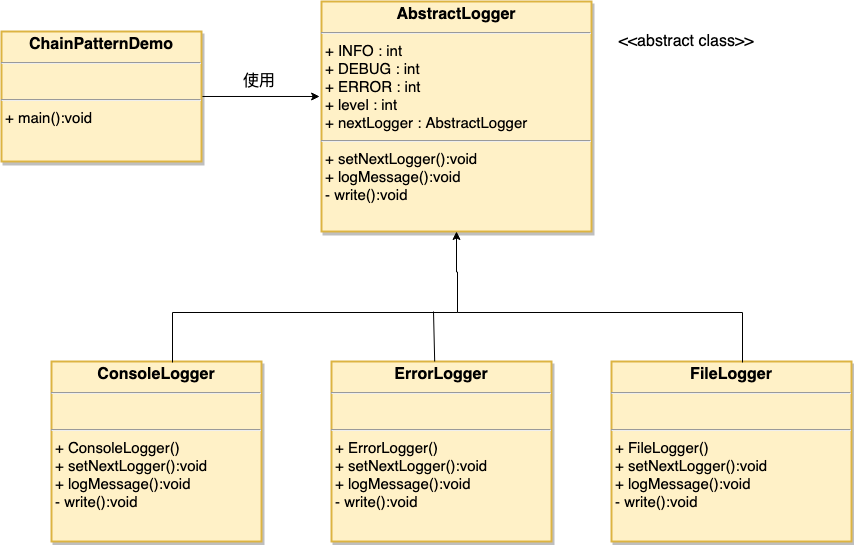

#责任链模式
顾名思义，责任链模式（Chain of Responsibility Pattern）为请求创建了一个接收者对象的链。这种模式给予请求的类型，对请求的发送者和接收者进行解耦。这种类型的设计模式属于行为型模式。

在这种模式中，通常每个接收者都包含对另一个接收者的引用。如果一个对象不能处理该请求，那么它会把相同的请求传给下一个接收者，依此类推。

##介绍
**意图：**
避免请求发送者与接收者耦合在一起，让多个对象都有可能接收请求，将这些对象连接成一条链，并且沿着这条链传递请求，直到有对象处理它为止。

**主要解决：**
职责链上的处理者负责处理请求，客户只需要将请求发送到职责链上即可，无须关心请求的处理细节和请求的传递，所以职责链将请求的发送者和请求的处理者解耦了。

**何时使用：**
在处理消息的时候以过滤很多道。

**如何解决：**
拦截的类都实现统一接口。

**关键代码：**
Handler 里面聚合它自己，在 HandlerRequest 里判断是否合适，如果没达到条件则向下传递，向谁传递之前 set 进去。

**应用实例：**
1. 红楼梦中的"击鼓传花"。
2. JS 中的事件冒泡。
3. JAVA WEB 中 Apache Tomcat 对 Encoding 的处理，Struts2 的拦截器，jsp servlet 的 Filter。

**优点：**
1. 降低耦合度。它将请求的发送者和接收者解耦。
2. 简化了对象。使得对象不需要知道链的结构。
3. 增强给对象指派职责的灵活性。通过改变链内的成员或者调动它们的次序，允许动态地新增或者删除责任。
4. 增加新的请求处理类很方便。

**缺点：**
1. 不能保证请求一定被接收。
2. 系统性能将受到一定影响，而且在进行代码调试时不太方便，可能会造成循环调用。
3. 可能不容易观察运行时的特征，有碍于除错。

**使用场景：**
1. 有多个对象可以处理同一个请求，具体哪个对象处理该请求由运行时刻自动确定。
2. 在不明确指定接收者的情况下，向多个对象中的一个提交一个请求。
3. 可动态指定一组对象处理请求。

**注意事项：**
在 JAVA WEB 中遇到很多应用。

##实现
我们创建抽象类 AbstractLogger，带有详细的日志记录级别。然后我们创建三种类型的记录器，都扩展了 AbstractLogger。每个记录器消息的级别是否属于自己的级别，如果是则相应地打印出来，否则将不打印并把消息传给下一个记录器。
